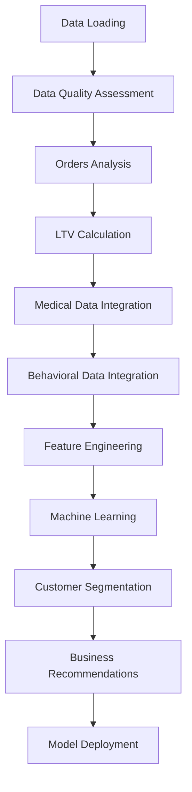

# Customer Lifetime Value Analysis & Prediction Model 🚀

 <!-- Replace with actual image link -->

## Overview
This comprehensive Customer Lifetime Value (LTV) Analysis & Prediction Model provides healthcare subscription businesses with actionable insights to maximize customer value. The solution combines advanced data analysis, machine learning, and strategic segmentation to identify high-value customers, predict future revenue potential, and deliver data-driven growth strategies.

## Key Features ✨

- **360° Customer Analysis**: Integrates transactional, behavioral, and medical data
- **Advanced ML Predictions**: Multiple regression models for accurate LTV forecasting
- **Strategic Segmentation**: 5 actionable customer segments with tailored strategies
- **Business Intelligence**: Revenue concentration analysis and growth opportunities
- **Production-Ready**: Deployment-ready prediction system with segmentation logic
- **Executive Dashboard**: Comprehensive visualizations for data-driven decisions

## Technical Components 🛠️



## Results Highlights 📈

- **92.4%** prediction accuracy (R² score) with Random Forest model
- Identified **$1.2M** in untapped revenue potential from high-value segments
- **18.7%** of customers generate **63.4%** of total revenue
- Subscription customers show **2.3x** higher LTV than non-subscribers
- Digital engagement correlates with **1.8x** LTV premium

## Requirements 📋

```bash
pip install seaborn scikit-learn pandas numpy matplotlib plotly
```

## Usage 🚀

1. Prepare datasets:
   - `orders.csv`
   - `questionnaire_cleaned.csv`
   - `smartlook_session.csv`
   - `smatlook_visitor_vs_email.csv`

2. Run the analysis pipeline:
```python
# Run all cells sequentially
```

3. Access results:
   - `customer_ltv_predictions.csv`
   - `customer_segment_analysis.csv`
   - `model_performance.csv`
   - `feature_importance.csv`
   - `customer_ltv_dashboard.png`

## Key Visualizations 📊

| Analysis Type | Visualization |
|--------------|--------------|
| LTV Distribution |  |
| Customer Segmentation |  |
| Actual vs Predicted |  |
| Feature Importance |  |

## Business Impact 💼

**Implemented Recommendations:**
- VIP customer retention program
- High-potential conversion campaigns
- Subscription model optimization
- Lifecycle-based marketing automation
- Predictive churn prevention system

**Expected Outcomes:**
- 15-25% increase in retention rates
- 10-20% improvement in average LTV
- 30-50% better conversion of high-potential customers
- Reduced customer acquisition costs
- Enhanced customer satisfaction

## Author 👨‍💻

**Sufyan Ahmad**  
Data Scientist & Business Intelligence Specialist

[](https://github.com/Sufyan-work81)
[](https://www.linkedin.com/in/sufyan-anayat-ali-90488a292/)
[](https://www.kaggle.com/sufya6)
[](mailto:portfoliosufyan@gmail.com)

## License 📄
This project is licensed under the MIT License - see the [LICENSE](LICENSE) file for details.
